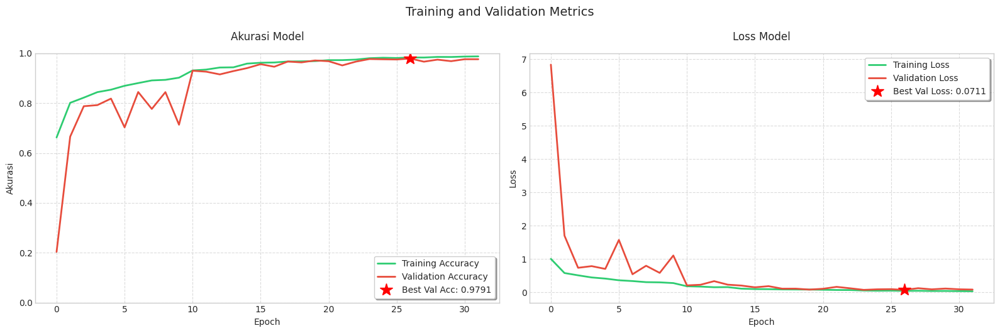
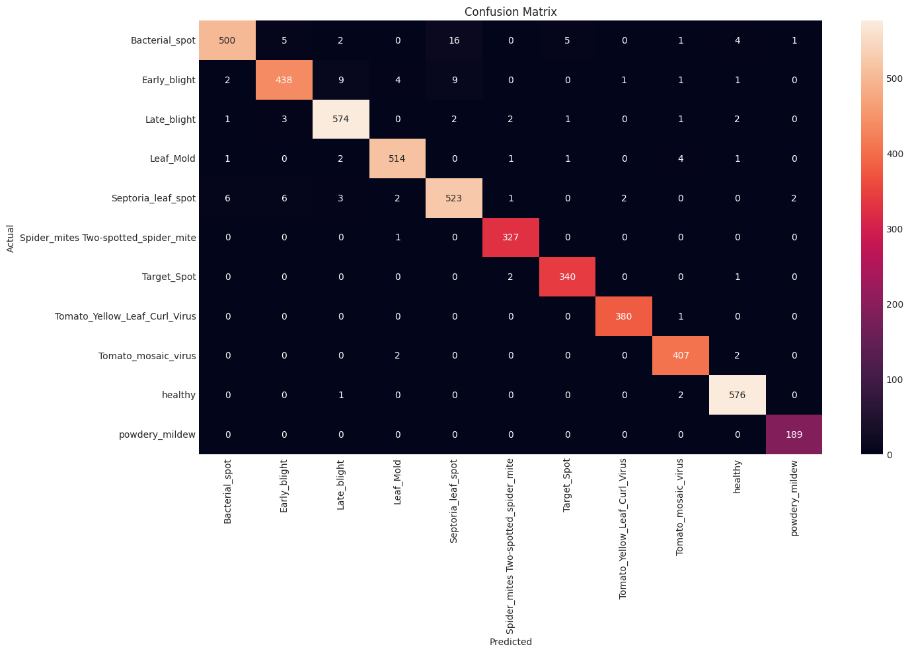
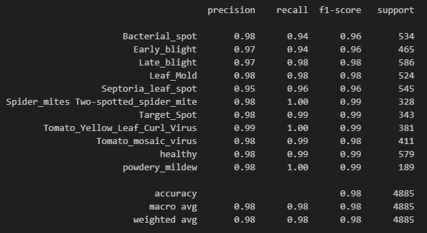

# Belajar Pengembangan Machine Learning Dicoding - Final Submission: Tomato Leaves Dataset

**Nama**: Rama Syailana Dewa  
**Username Dicoding**: masdewa  

---

| **Aspek** | **Deskripsi** |
|----------|---------------|
| **Dataset** | [Kaggle: Tomato Leaves Dataset](https://www.kaggle.com/datasets/ashishmotwani/tomato) dengan lebih dari 32.000 gambar daun tomat yang diklasifikasikan ke dalam 11 kelas, termasuk daun sehat dan 10 jenis penyakit. |
| **Permasalahan** | Penyakit pada daun tomat dapat menurunkan hasil panen dan kualitas pertanian. Proses identifikasi manual membutuhkan keahlian dan waktu, sehingga dibutuhkan sistem otomatis berbasis machine learning untuk mendeteksi penyakit dari gambar daun tomat dengan cepat dan akurat. |
| **Solusi Machine Learning** | Dibangun model klasifikasi citra berbasis deep learning untuk mengenali 11 kelas penyakit daun tomat. Model ini diharapkan dapat membantu petani dalam melakukan diagnosis awal secara efisien. |
| **Pengolahan Data** | Dataset dibagi ke dalam train (70%), validation (15%), dan test (15%). Data augmentasi dilakukan menggunakan `ImageDataGenerator` (rotasi, zoom, shear, shift, flip, brightness). Gambar dinormalisasi (`rescale=1./255`) dan diubah ukurannya ke 256x256 piksel. Label dikonversi ke one-hot encoding. |
| **Arsitektur Model** | Menggunakan pre-trained **MobileNetV2** (tanpa `include_top`) sebagai feature extractor. Ditambahkan layer `Conv2D`, `MaxPooling2D`, `GlobalAveragePooling2D`, dan `Dense` untuk klasifikasi. Output layer menggunakan `softmax` dengan 11 neuron. |
| **Kode Inti Model** | ```python<br>base_model = MobileNetV2(input_shape=(224, 224, 3), include_top=False, weights='imagenet')<br>model = Sequential([<br>&nbsp;&nbsp;&nbsp;&nbsp;base_model,<br>&nbsp;&nbsp;&nbsp;&nbsp;Conv2D(64, (3, 3), activation='relu', padding='same'),<br>&nbsp;&nbsp;&nbsp;&nbsp;MaxPooling2D(2, 2),<br>&nbsp;&nbsp;&nbsp;&nbsp;GlobalAveragePooling2D(),<br>&nbsp;&nbsp;&nbsp;&nbsp;Dense(128, activation='relu'),<br>&nbsp;&nbsp;&nbsp;&nbsp;Dense(11, activation='softmax')<br>])<br>model.compile(optimizer='adam', loss='categorical_crossentropy', metrics=['accuracy']) ``` |
| **Metrik Evaluasi** | Menggunakan `categorical_accuracy`. Visualisasi training & validation dilakukan melalui grafik akurasi dan loss. Dan juga Confusion Matrix|
| **Performa Model** | Akurasi pelatihan mencapai **98.62%**, validasi **97.62%** dan testing **97.60%**, menunjukkan generalisasi yang baik dan tidak overfitting. |
| **Kesimpulan** | Model berhasil dikembangkan untuk klasifikasi penyakit daun tomat dengan akurasi validasi tinggi. Sistem ini dapat dikembangkan lebih lanjut untuk aplikasi mobile dan mendukung pertanian digital di masa depan. |

---
## 🧾 Grafik Training Matrix 



---
## 🧾 Confusion Matrix



Confusion Matrix di atas menunjukkan prediksi model pada data uji (test set). Sebagian besar kelas berhasil diprediksi dengan akurasi tinggi, meskipun ada beberapa kebingungan antar kelas yang mirip secara visual.

---
## 🧾 Confusion Matrix



---
> 📌 *Submission ini dibuat untuk memenuhi tugas akhir kelas Belajar Pengembangan Machine Learning Dicoding.*
